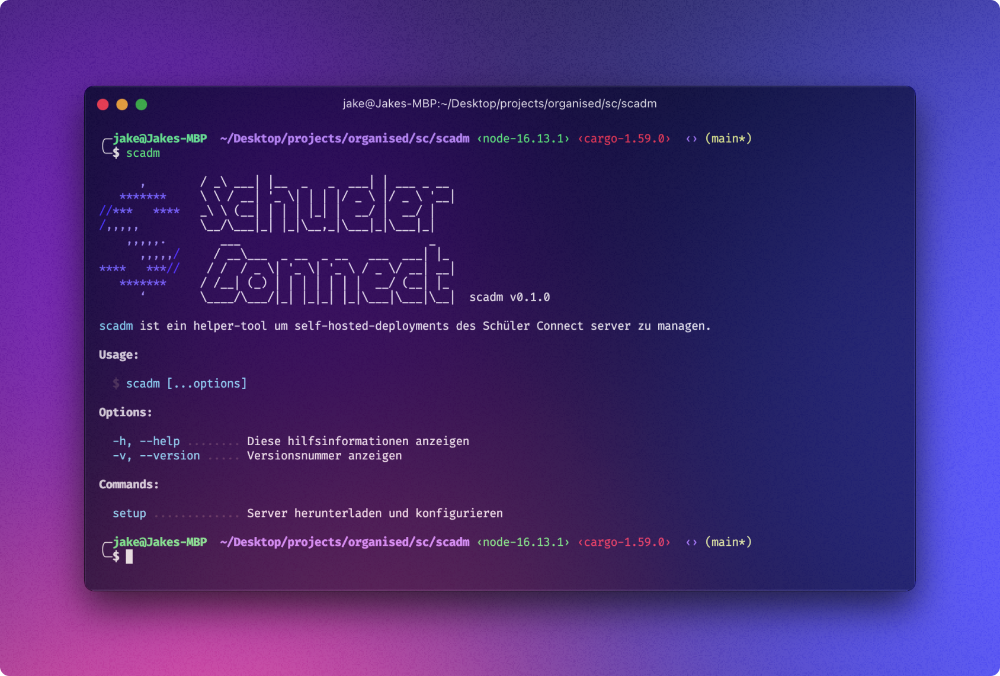

<h3>Schüler Connect</h1>

Built with ❤️ by <a href="https://github.com/codemaster138">@codemaster138</a> and <a href="https://github.com/cubeforme">@cubeforme</a>

Schüler Connect ist ein im Hackathon [#ideenfürdiejugend](https://ideenfuerdiejugend.de/) enstandenes und durch im Rahmen des [Projekts Jugendbudet](https://ideenfuerdiejugend.de/das-jugendbudget/) durch den [BJR](https://bjr.de/) gefördertes Software-Projekt.

`scadm`
 ist ein tool, das Ihnen hilft, den [SC Server](https://github.com/schueler-connect/backend) einzurichten und zu verwalten.

<!-- TODO: Finish README! -->

Copyright © 2022-present <a href="https://github.com/codemaster138/">@codemaster138</a> & <a href="https://github.com/cubeforme/">@cubeforme</a>

